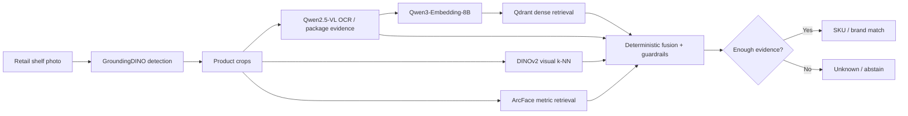

 

 

 

 

<b>Open to Senior Applied AI · Forward-Deployed Engineering · AI Solutions Architecture roles</b>

  

**[Production](#-production-ai-end-to-end) · [Live system](#-what-production-looks-like) · [Engineering](#-featured-engineering) · [Stack](#-ai--ml-stack) · [Principles](#-engineering-dna) · [Repositories](#-repositories--recent-work)**

---

## ⚡ Production AI, end to end

I design, build and operate **production AI systems with end-to-end technical ownership** — from computer-vision models and GPU inference to LLM agents, business integrations, backend/data layers and product interfaces.

My bias is toward **measurable impact, honest evaluation and systems that stay reliable after the demo is over**.

<table>
<tr>
<td width="25%" align="center">
<h2>~3,800</h2>
<b>Retail outlets</b> 
~1,500 active monthly
</td>
<td width="25%" align="center">
<h2>9–11k</h2>
<b>Orders / month</b> 
98% via platform
</td>
<td width="25%" align="center">
<h2>0.91</h2>
<b>Detection F1</b> 
on unseen shelf images
</td>
<td width="25%" align="center">
<h2>95.8%</h2>
<b>Brand precision</b> 
confirmed end-to-end evaluation
</td>
</tr>
</table>

<table>
<tr>
<td width="25%" align="center"><b>🧠 20+ typed tools</b> production agent layer</td>
<td width="25%" align="center"><b>⚡ NVIDIA H200</b> self-hosted AI inference</td>
<td width="25%" align="center"><b>🤖 Self-hosted Qwen</b> Qwen2.5-VL 72B · Qwen3.6 35B served with vLLM</td>
<td width="25%" align="center"><b>🎯 73.1% SKU precision</b> end-to-end retrieval + fusion</td>
</tr>
</table>

> 🔒 **Most production code is private** because it runs inside commercial systems with proprietary data and business integrations. The public repositories below contain **sanitized case studies, architecture, metrics, evaluation methodology and runnable examples**.

## 👁 What production looks like

Real shelf photo through the production CV pipeline — detections, SKU labels, price-tag reads and explicit <code>Unknown</code> when evidence is insufficient.

## 🧩 One system, not isolated models

> **Production principle:** confidence is not correctness. A real AI system should be able to **abstain**, run in shadow before promotion, be evaluated on real populations and roll back cleanly.

## 🚀 Featured engineering

<table>
<tr>
<td width="33%" valign="top">

### 🧠 [AI Platform Portfolio →](https://github.com/swd07/ai-platform-portfolio)

Production case studies with **architecture, metrics, engineering decisions and evaluation methodology**.

`AI Platform` `Agents` `Architecture` `Voice AI` `Product Engineering`

**Includes:**
- FMCG commercial operating platform
- AI infrastructure control plane & security operations
- voice-first multi-agent orchestrator
- coaching / fitness product

</td>
<td width="33%" valign="top">

### 👁 [Retail Shelf Detection →](https://github.com/swd07/retail-shelf-detection)

Production-engineered **retrieval + computer-vision merchandising pipeline** with explicit uncertainty.

`Detection` `OCR` `VLM` `Qdrant` `DINOv2` `ArcFace`

**Evidence:**
- 95.8% brand precision
- 73.1% SKU precision
- 47k-box replay harness
- shadow → active rollout gates

</td>
<td width="33%" valign="top">

### 🤖 [Jarvis Agent Orchestrator →](https://github.com/swd07/ai-platform-portfolio/blob/master/projects/jarvis.md)

Voice-first **executive and operations command center** that delegates bounded work across specialized agents and returns grounded results.

`WebRTC` `Agent Registry` `Command Queues` `Tool Calling` `Executive AI`

**Capabilities:**
- live agent heartbeat / task / queue state
- allowlisted agent-command dispatch
- project risks, deadlines & blockers
- safe voice-opened dashboards

</td>
</tr>
<tr>
<td width="50%" valign="top">

### 📈 [AI Marketing & Brand Growth →](https://github.com/swd07/ai-platform-portfolio/blob/master/projects/marketing-platform.md)

Multi-source **marketing intelligence platform** connecting social, website, search and campaign analytics.

`Instagram API` `Search` `Traffic` `Content Intelligence` `AI Reporting`

**Measured window:**
- +2,859 Instagram followers
- +88% website visits
- 17.6% Google Search CTR
- 2.4 average search position

</td>
<td width="50%" valign="top">

### 🛡 [AI Infrastructure Control Plane →](https://github.com/swd07/ai-platform-portfolio/blob/master/projects/infra-monitoring-agent.md)

Self-hosted **operations and security layer for production AI infrastructure** with deterministic detection and AI-assisted investigation.

`AIOps` `Security` `H200 Observability` `Qwen` `Tool Calling` `Incident Response`

**Production evidence:**
- 15+ detector types
- ~22 monitored endpoints
- 60-second autonomous watch loop
- 152 alerts recorded in Aug 2026

</td>
</tr>
</table>

## 🛠 AI / ML stack

  

`Computer Vision` · `OCR` · `Vision-Language Models` · `Dense Retrieval` · `Retrieval-Augmented Systems` · `Vector Search` · `LLM Agents` · `Multi-Agent Orchestration` · `Tool Calling` · `MCP` · `GPU Inference` · `Evaluation` · `Observability` · `Marketing Intelligence`

## 🧬 Engineering DNA

<table>
<tr>
<td width="25%" valign="top"><b>🎯 Evaluate first</b>  Golden-set regression, replay, acceptance gates and population-level validation before promotion.</td>
<td width="25%" valign="top"><b>🛡 Safe rollout</b>  Shadow → measure → gate → active, with explicit rollback paths.</td>
<td width="25%" valign="top"><b>⚙️ Deterministic where possible</b>  LLMs augment reliable systems; they do not replace reliable logic without reason.</td>
<td width="25%" valign="top"><b>🏗 End-to-end ownership</b>  Model layer, backend, data, integrations, frontend, deployment and operations.</td>
</tr>
</table>

## 📦 Repositories & recent work

  

---

### Building AI systems that actually reach production.

**Applied AI · Production Retrieval · Computer Vision · LLM Systems · Multi-Agent Orchestration · AI Infrastructure · Growth Systems · Product Engineering**

 

