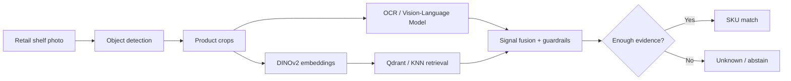

# Eduard Kharaev

### Applied AI Engineer · Forward-Deployed Engineer · AI Platform Architect

**I build production AI systems end-to-end — from models and GPU inference to business workflows and full-stack products.**

---

## What I build

I design, build and operate **production AI systems as the sole technical owner** — computer vision pipelines, LLM agents, GPU inference infrastructure, ERP/business integrations and full-stack AI products.

My focus is not demo-only AI. I care about **measurable production impact, evaluation discipline, observability, safe rollout gates and systems that survive real users and real data**.

<table>
<tr>
<td width="25%" align="center"><b>👁 Computer Vision</b> Detection · OCR · VLM · embeddings</td>
<td width="25%" align="center"><b>🧠 LLM Systems</b> Agents · tools · MCP · RAG</td>
<td width="25%" align="center"><b>⚡ AI Infrastructure</b> H200 · vLLM · self-hosted inference</td>
<td width="25%" align="center"><b>🏗 Product Engineering</b> Backend · data · web · mobile</td>
</tr>
</table>

## Selected impact

| Production result | Impact |
|---|---:|
| AI sales & merchandising platform | **~2,000 retail outlets · 500–700 orders/day** |
| AI-driven order channel | **~60% of orders** |
| Shelf detection on unseen images | **F1 0.68 → 0.91** |
| SKU recognition | **95.8% accuracy** |
| Production agent layer | **20+ typed tools** |
| GPU inference | **NVIDIA H200 · 72B AWQ · 35B FP8** |

## Production AI architecture

**Engineering principle:** confidence is not correctness. Production AI should be able to **abstain**, be evaluated against real populations, run in shadow before promotion, and roll back cleanly.

## Featured work

<table>
<tr>
<td width="50%" valign="top">

### 🧠 [AI Platform Portfolio](https://github.com/swd07/ai-platform-portfolio)

Sanitized production case studies with architectures, metrics, technical decisions and honest write-ups — including changes that **failed acceptance gates and were not promoted**.

**Includes:**
- Commercial AI operating system for FMCG
- Shelf-recognition CV platform
- Real-time voice assistant
- AIOps monitoring agent
- Social intelligence platform
- Fitness coaching platform

</td>
<td width="50%" valign="top">

### 👁 [Retail Shelf Detection](https://github.com/swd07/retail-shelf-detection)

Public case study and runnable examples for a production computer-vision merchandising pipeline.

**Pipeline:**
- detection + crop extraction
- OCR / VLM text reading
- DINOv2 visual embeddings
- vector retrieval / SKU matching
- guardrails and explicit `Unknown`
- production evaluation methodology

</td>
</tr>
</table>

## AI / ML stack

  

  
  
  
  
  
  
  
  

### Core areas

`Computer Vision` · `OCR` · `Vision-Language Models` · `LLM Agents` · `Tool Calling` · `MCP` · `RAG` · `Vector Search` · `GPU Inference` · `Evaluation` · `Observability` · `Production Architecture`

## How I engineer AI systems

- **Production first** — architecture is shaped by latency, failure modes, cost, observability and operational reality.
- **Evaluation before promotion** — golden-set regression, replay, pre-registered acceptance gates and population-level validation.
- **Safe rollout** — shadow → measure → gate → active, with explicit rollback paths.
- **Deterministic where possible** — LLMs augment systems; they do not replace reliable logic where reliable logic is available.
- **End-to-end ownership** — model layer, backend, data, integrations, frontend, deployment and production operations.

## GitHub activity

---

### Open to senior Applied AI / Forward-Deployed Engineering and AI Platform Architecture roles

**Production AI · Computer Vision · LLM Systems · AI Infrastructure**

[Portfolio](https://github.com/swd07/ai-platform-portfolio) · [Telegram](https://t.me/Edharaev) · [Email](mailto:haraev87@gmail.com)

