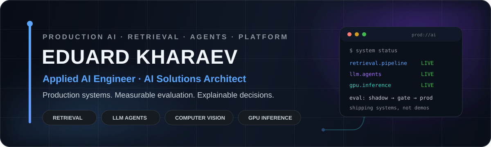
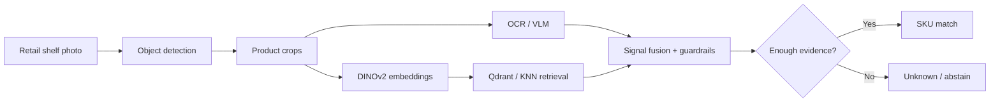

 

 

---

## ⚡ Production AI, end to end

I design, build and operate **production AI systems as the sole technical owner** — from computer-vision models and GPU inference to LLM agents, business integrations, backend/data layers and product interfaces.

My bias is toward **measurable impact, honest evaluation and systems that stay reliable after the demo is over**.

<table>
<tr>
<td width="25%" align="center">
<h2>~2,000</h2>
<b>Retail outlets</b> 
connected to the AI sales platform
</td>
<td width="25%" align="center">
<h2>500–700</h2>
<b>Orders / day</b> 
through production workflows
</td>
<td width="25%" align="center">
<h2>0.68 → 0.91</h2>
<b>Detection F1</b> 
on unseen shelf images
</td>
<td width="25%" align="center">
<h2>95.8%</h2>
<b>SKU recognition</b> 
production recognition accuracy
</td>
</tr>
</table>

<table>
<tr>
<td width="25%" align="center"><b>🧠 20+ typed tools</b> production agent layer</td>
<td width="25%" align="center"><b>⚡ NVIDIA H200</b> self-hosted AI inference</td>
<td width="25%" align="center"><b>🤖 72B AWQ / 35B FP8</b> served with vLLM</td>
<td width="25%" align="center"><b>📈 ~60% AI channel</b> share of production orders</td>
</tr>
</table>

## 👁 What production looks like

Real shelf photo through the production CV pipeline — detections, SKU labels, price-tag reads and explicit <code>Unknown</code> when evidence is insufficient.

## 🧩 One system, not isolated models

> **Production principle:** confidence is not correctness. A real AI system should be able to **abstain**, run in shadow before promotion, be evaluated on real populations and roll back cleanly.

## 🚀 Featured engineering

<table>
<tr>
<td width="50%" valign="top">

### 🧠 [AI Platform Portfolio →](https://github.com/swd07/ai-platform-portfolio)

Production case studies with **architecture, metrics, engineering decisions and evaluation methodology** — sanitized for public access.

`Computer Vision` `LLM Agents` `Voice AI` `AIOps` `Full-stack AI`

**Inside:**
- FMCG commercial AI operating system
- retail shelf-recognition platform
- real-time voice assistant
- infrastructure monitoring agent
- social-media intelligence
- coaching / fitness platform

</td>
<td width="50%" valign="top">

### 👁 [Retail Shelf Detection →](https://github.com/swd07/retail-shelf-detection)

Public case study and runnable examples for a **production computer-vision merchandising pipeline**.

`Detection` `OCR` `VLM` `DINOv2` `Qdrant` `Guardrails`

**Pipeline:**
- object detection + crop extraction
- OCR / vision-language text reading
- visual embeddings + vector retrieval
- SKU fusion / disambiguation
- explicit `Unknown` instead of confident errors
- production evaluation and rollout gates

</td>
</tr>
</table>

## 🛠 AI / ML stack

  

`Computer Vision` · `OCR` · `Vision-Language Models` · `LLM Agents` · `Tool Calling` · `MCP` · `RAG` · `Vector Search` · `GPU Inference` · `Evaluation` · `Observability`

## 🧬 Engineering DNA

<table>
<tr>
<td width="25%" valign="top"><b>🎯 Evaluate first</b>  Golden-set regression, replay, acceptance gates and population-level validation before promotion.</td>
<td width="25%" valign="top"><b>🛡 Safe rollout</b>  Shadow → measure → gate → active, with explicit rollback paths.</td>
<td width="25%" valign="top"><b>⚙️ Deterministic where possible</b>  LLMs augment reliable systems; they do not replace reliable logic without reason.</td>
<td width="25%" valign="top"><b>🏗 End-to-end ownership</b>  Model layer, backend, data, integrations, frontend, deployment and operations.</td>
</tr>
</table>

## 📊 GitHub activity

 

---

### Building AI systems that actually reach production.

**Applied AI · Computer Vision · LLM Systems · AI Infrastructure · Product Engineering**

 

